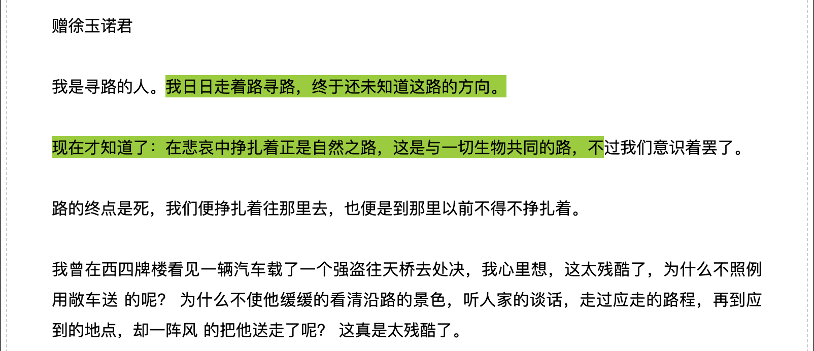
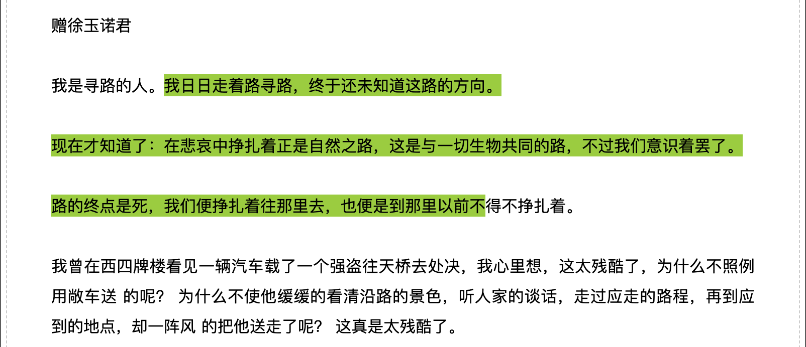
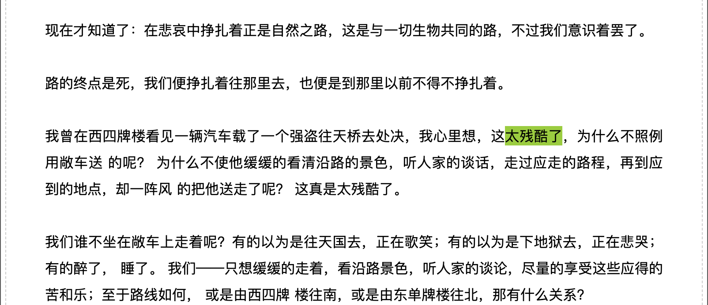
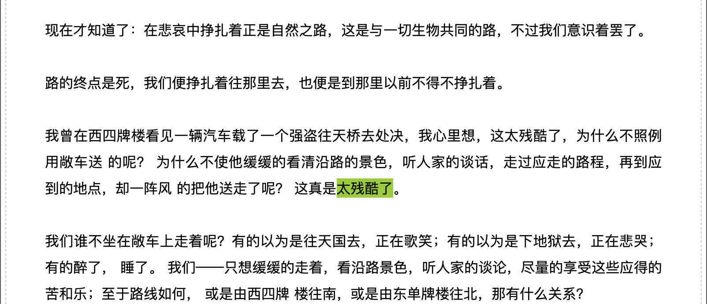
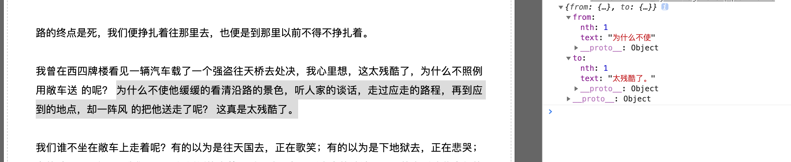
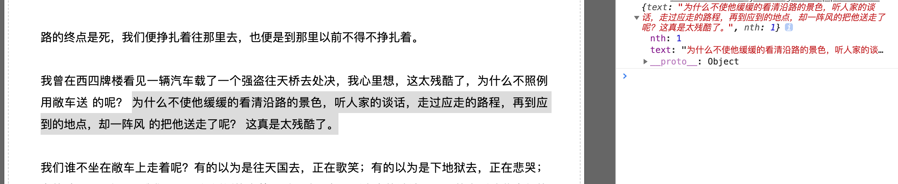

# Texton

[](https://github.com/prettier/prettier)

A js/ts library project that enables you to 
* serialize user `Selection`/dom `Range` into simple pojos and persist it somewhere;
* deserialize/restore user `Selection`/dom `Range` on web pages from pojos 
extremely easy.

It is especially useful to make WYSIWYG apps or webpage tagging, annotating and bookmarking 
tools like 
[Anylink](https://chrome.google.com/webstore/detail/any-link-safereliable-lin/mpflpgaobfpjcpefkdnpalfdodifkkgc), 
[Diigo](https://chrome.google.com/webstore/detail/diigo-web-collector-captu/pnhplgjpclknigjpccbcnmicgcieojbh),
[Web Highlighter](https://alienzhou.github.io/web-highlighter/)
## Usage

```bash
npm install texton -S
```

**Start coding!**

### Concepts
 - `XSelection` is the core class, which encapsulates the native `Selection`/`Range` and provides 
 rich methods on serializing user `Selection` and restoring user `Selection`/`XSelection` from 
 different types of serialized data.
 
 - `XDocument` constructs the context of `XSelection`, that is the scope where `XSelection` should 
 work.

### Importing library

#### ES6
```typescript
import {XDocument, XSelection} from 'texton';
const doc = XDocument.from(document.querySelector('#content'));
```

#### AMD
```xhtml
<html>
  <head>
      <script type="text/javascript" src="path/to/texton.umd.js"></script>
  </head>
  <body>
    <!-- ... -->
    <div id="content">
    <!-- ... -->
    </div>
    <!-- ... -->
    <script>
      const {XDocument, XSelection} = texton;
      const doc = XDocument.from(document.querySelector('#content'));
      function serialize(){
        let selection = window.getSelection();
        const xSelection = doc.fromSelection(selection);
        const serialized = xSelection.getTextRange();
          
        // store(serialized);      
      } 
      
      function restore(serialized){
        // const stored = StorageService.get();
        const xSelection = XSelection.fromTextRange(serialized, true, doc);
        const selection = window.getSelection(); // native selection
      }   

      function highlight(serialized){
        const xSelection = XSelection.fromTextRange(serialized, true, doc);
        const textNodes = xSelection.texts;
        textNodes.forEach((text) => {
          const $mark = document.createElement('em');
          $mark.classList.add('markup');
          text.replaceWith($mark);
          $mark.appendChild(text);
        });
      }   
    </script>
  </body>
</html>
```
## Features 
refer `example/article.html`
```xhtml
<html xmlns="http://www.w3.org/1999/xhtml" xml:lang="zh-CN" lang="zh-CN">
<head>
  <title>寻路的人 周作人</title>
</head>
<body>
<div id="article_show">
  <h1>寻路的人</h1>
  <p class="article_author"><span>周作人</span></p>
  <div class="article_text">
    <p>赠徐玉诺君</p>
    <p>我是寻路的人。我日日走着路寻路，终于还未知道这路的方向。</p>
    <p>
      现在才知道了：在悲哀中挣扎着正是自然之路，这是与一切生物共同的路，不过我们意识着罢了。
    </p>
    <p>路的终点是死，我们便挣扎着往那里去，也便是到那里以前不得不挣扎着。</p>
    <p>
      我曾在西四牌楼看见一辆汽车载了一个强盗往天桥去处决，我心里想，这太残酷了，为什么不照例
      用敞车送 的呢？ 为什么不使他缓缓的看清沿路的景色，听人家的谈话，走过应走的路程，再到应
      到的地点，却一阵风 的把他送走了呢？ 这真是太残酷了。
    </p>
    <p>
      我们谁不坐在敞车上走着呢？有的以为是往天国去，正在歌笑；有的以为是下地狱去，正在悲哭；
      有的醉了， 睡了。 我们——只想缓缓的走着，看沿路景色，听人家的谈论，尽量的享受这些应得的
      苦和乐；至于路线如何， 或是由西四牌 楼往南，或是由东单牌楼往北，那有什么关系？
    </p>
    <p>
      玉诺是于悲哀深有阅历的，这一回他的村寨被土匪攻破，只有他的父亲在外边，此外人都还没有消
      息。他说， 他现在 没有泪了。——你也已经寻到了你的路了吧。
    </p>
    <p>
      他的似乎微笑的脸，最令我记忆，这真是永远的旅人的颜色。我们应当是最大的乐天家，因为再没
      有什么悲观 和失望了。
    </p>
    <p>周作人，一九二三年七月三十日</p>
  </div>
</div>
<script type="text/javascript" src="../dist/texton.umd.js"></script>
<script type="text/javascript">
  function renderSelection(selection) {
    if (selection && selection.getOccurrence().nth >= 0) {
      selection.texts.forEach((text) => {
        const $mark = document.createElement('em');
        $mark.classList.add('markup');
        text.replaceWith($mark);
        $mark.appendChild(text);
      });
    }
  }
</script>
<style type="text/css">
  em.markup {
    background-color: yellowgreen;
    font-style: normal;
  }
</style>
</body>
</html>
```

### create selection from text range
```javascript
  const {XDocument, XSelection} = texton;
  const doc = XDocument.from(document.body);

  const textRange1 = {from: {text: "我日日走着", nth: 1}, to: {text: "不", nth: 1}};
  const range1 = doc.fromTextRange(textRange1);
  renderSelection(range1);
```


```javascript
  const textRange2 = {from: {text: "我日日走着", nth: 1}, to: {text: "不", nth: 2}};
  const range2 = doc.fromTextRange(textRange2);
  renderSelection(range2);
```


### create selection from text 'occurrence'
```javascript
  const {XDocument, XSelection} = texton;
  const doc = XDocument.from(document.body);

  const text1 = doc.fromText('太残酷了', 1);
  renderSelection(text1);
```


```javascript
  const text2 = doc.fromText('太残酷了', 2);
  renderSelection(text2);
```


### serialize selection into text 'occurrence'
```javascript
  doc.root.addEventListener('mouseup', () => {
    const selection = doc.fromSelection(window.getSelection());
    console.log(selection.getTextRange(5));
  });
```

```javascript
  doc.root.addEventListener('mouseup', () => {
    const selection = doc.fromSelection(window.getSelection());
    console.log({
      text: selection.getContent(true),
      nth: selection.getOccurrence().nth,
    });
  });
```

## Projects using `texton`

Here are some projects that are using `texton`:
- [Anylink - Linkify/Highlight Any Text on Any Web Pages](https://chrome.google.com/webstore/detail/any-link-safereliable-lin/mpflpgaobfpjcpefkdnpalfdodifkkgc)

## Credits

Made with :heart: by [Miller](mailto:gr8miller@hotmail.com)
